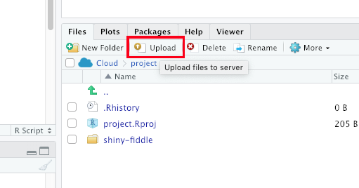

<style>
p{font-size:15px;}
h1{font-weight: bold;}
h2{color: #336699;}
h3{color: #666666;}
ul{font-size:14px;}
ol{font-size:15px;}
</style>


```{r setup, include=FALSE}
knitr::opts_chunk$set(echo = TRUE)
```

# Workflow

1. Read data
2. Get familiar with the data set
  - Print a few rows
  - Look at the structure
  - List the column names
  - Determine the number of rows and columns


## 1. Read Data

First step is to obtain the data.  Often it is necessary to collect data through sampling of certain populations.  In this course, we will use publicly available data sets.
This is obviously a crucial step (without reading the data, we can not do any exploration or analysis).  Common file formats include, .txt, .csv, .tsv, .xls, .dat, .data, .rda, etc.  


CSV stands for "comma separated values" and is a *very* common data format.  

### Read a CSV file from URL

The R function to read a CSV file from a URL is `read.csv('URL')`.

Read data from the following url:  
`https://raw.githubusercontent.com/jamesquinlan/dsc130-datasci-R/main/data/student_debt.csv`


```{r}
# URL
data = read.csv('https://raw.githubusercontent.com/jamesquinlan/dsc130-datasci-R/main/data/student_debt.csv') 

```

## 2. Get familiar with  the data set

### Print a few rows of Data Frame 
```{r}
head(data)
```

### List Column Names of Data Frame Using names() Function
```{r}
names(data)
```
Alternatively, use `colnames()`
```{r}
colnames(data)
```

### Get Number of Rows & Columns

```{r}
dim(data)   # Rows x Columns  (observations x features)
```
### Look at the structure


```{r}
str(data) 
```
It shows: 

* the data is contained in a `data.frame`,
* there are 30 records and 4 variables (or features)
* `year` is an integer data type
* `race` is a character
* `loan_debt` and `loan_debt_pct` are numbers.  

Later we may **change the data type** of `race`.  

<!--
as.factor(data$race)
p = plot(df44$loan_debt ~ df44$year, pch = as.numeric(df44$race), col=df44$race)
legend("topright", legend = c("Black", "Hispanic", "White"), pch = as.numeric(df44$race), col=df44$race)

-->


#### Try it!

Practice importing and initial exploration of data.  Here are a few URLs:

Retirement by Race

`https://raw.githubusercontent.com/rfordatascience/tidytuesday/master/data/2021/2021-02-09/retirement.csv`


Frog Measurements

`https://vincentarelbundock.github.io/Rdatasets/csv/DAAG/frogs.csv`

```{r}
frogs = read.csv('https://vincentarelbundock.github.io/Rdatasets/csv/DAAG/frogs.csv')
```

```{r}
head(frogs)
```

---


# Upload Data to Cloud

You can upload data to the cloud, then import from there.  Make sure to notice which directory (path) you upload.



---

### Read from local directory

> **Note**: There is a directory called `data` in this project.  

```{r}
sports = read.csv('data/sports.csv')
```

---


#### Try it!

1. Download a data set from the internet or use one that already exists on you computer.  *Remember to pay attention to the directory where this file downloads*.    

1. Upload it to the R cloud.

1. Read and explore (look at the data, the structure, etc.).


### Load R data

R data has `.rda` extension.  Load this data (and all workspace variables) using `load()` command.

```{r}
load('data/bigmac.rda')
```

---


#### Try it!

1. Upload `bigmac.rda` to the R cloud.  (If you are working from this project, you will not need to upload these files.  However, it is strongly encouraged to replicate the project and upload files, etc.)

1. Load and explore (look at the data, the structure, etc.).


---

### Questions

1. How would you read Excel files (.xls or .xlsx)?

1. How would you read text file data (.txt)?

1. How would you create a new directory for images?  

 